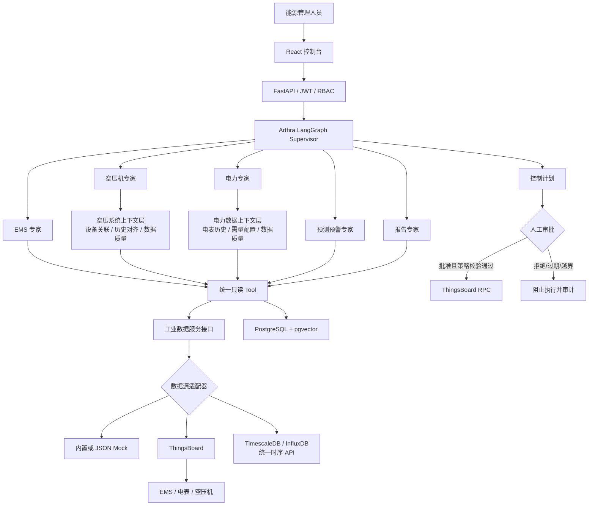

# Arthra AI 能碳大脑

Arthra 是一个以 **LangGraph 多专家编排**和**统一工业数据接口**为主线的能碳管理 MVP。它将 EMS、电力、空压机、预测预警和报告专家组织成可持久化工作流，读取侧可切换 ThingsBoard、Mock 或时序 API，并在任何设备控制之前强制进入人工审批。

## 架构



## 功能

| 能力 | MVP 实现 |
| --- | --- |
| 能力识别 | “问题模式 → 业务领域 → 专业意图”三级路由；高置信受控问法优先匹配，未登记问题使用 Qwen/OpenAI-compatible 语义分类，全部结果经过 Pydantic 校验 |
| 模型 | OpenAI-compatible 接口，可配置 OpenAI、Qwen、DeepSeek、Ollama 或 vLLM |
| 状态 | LangGraph PostgreSQL Checkpoint，线程由 `thread_id` 隔离 |
| 知识库 | 文本切分、pgvector、相似度检索与引用接口 |
| 工业数据 | 统一设备/遥测/属性/告警协议，可配置 ThingsBoard、内置/文件 Mock、通用时序 API |
| IoT 控制 | ThingsBoard 双向 RPC；读取适配器切换不改变审批和控制安全边界 |
| 安全控制 | 白名单、参数限幅、10 分钟有效期、RBAC 审批、全链路审计 |
| 演示数据 | EMS、开山空压机和 ADL400 电表模拟器，按点表上报遥测/属性并响应 RPC |
| AI 每日摘要 | 聚合最近 24 小时遥测、告警与确定性规则，每天自动生成并支持手动刷新 |
| 空压系统上下文 | 按 `airSystemId` 关联空压机和电表，统一查询24小时历史、时间桶和数据质量 |
| 空压专家工具 | 实时状态、周期电量、加载/卸载率、空载、启停、压力、高压、比功率、群控、泄漏、节能初筛与效果验证 |
| 电力专家工具 | 实时功率、周期电量、同期比较、15分钟需量、峰值、峰均比、越限、电压、不平衡、功率因数、THD、谐波和异常持续时间 |
| 数据契约 | Pydantic v2 严格模型覆盖统一工业数据、外部适配器投影、Agent、领域上下文、控制、日报、知识与审计 |
| 控制台 | 能源总览、每日摘要、SSE 对话、知识库、控制审批和审计页面 |

## 目录

```text
apps/api/               FastAPI、LangGraph、数据模型与 Alembic
apps/api/arthra/contracts.py 共享严格模型、JSON/遥测值类型、告警与引用契约
apps/api/arthra/thingsboard_schemas.py ThingsBoard 外部响应投影与 RPC 契约
apps/api/arthra/industrial_data/ 统一工业数据模型、Protocol、服务、工厂和三类适配器
apps/api/arthra/agent_schemas.py 通用设备上下文和专家分析契约
apps/api/arthra/question_answering.py 受控问答意图、工具白名单、设备编号和时间窗口解析
apps/api/arthra/daily_schemas.py 每日摘要统计、设备、告警和快照契约
apps/api/arthra/compressor/ 空压系统上下文、质量检查、确定性特征和只读工具
apps/api/arthra/power/      电力数据上下文、需量/电能质量确定性算法和只读工具
apps/web/               React + TypeScript 控制台
services/simulator/     ThingsBoard 三设备遥测/RPC 模拟器
tests/                  路由、安全策略、知识切分与密码测试
docker-compose.yml      完整本地运行栈
.env.example            可提交的环境变量模板
AGENTS.md                Agent/开发者协作约束
```

## 环境要求

- Docker Desktop 与 Docker Compose v2
- 本地开发可选：Python 3.12、uv 0.11+、Node.js 24、pnpm 11
- 建议至少 8 GB 可用内存；ThingsBoard 首次初始化需要数分钟

> 当前 Windows 环境曾出现 Docker 无法读取 `C:\Users\Aethr\.docker\config.json` 的警告。若启动失败，请先在 Docker Desktop 中确认引擎已运行，并修复该文件的读取权限。项目不会自动删除或覆盖用户 Docker 配置。

## 一键启动

```powershell
Copy-Item .env.example .env
# 修改 .env 中的 APP_SECRET_KEY、管理员密码和可选模型配置
docker compose up -d --build
docker compose ps
```

本仓库已附带仅用于本地演示的 `.env`；任何共享或部署前都必须修改其中密钥。

启动完成后访问：

- Arthra 控制台：[http://localhost:8080](http://localhost:8080)
- Arthra API/Swagger：[http://localhost:8000/docs](http://localhost:8000/docs)
- ThingsBoard：[http://localhost:9090](http://localhost:9090)

默认演示账号：

| 系统 | 账号 | 密码 |
| --- | --- | --- |
| Arthra | `admin@arthra.local` | `Arthra@123456` |
| ThingsBoard Tenant | `tenant@thingsboard.org` | `tenant` |

查看日志或停止：

```powershell
docker compose logs -f api simulator thingsboard
docker compose down
```

## 模型配置

对话模型与嵌入模型独立配置。两者都遵循 OpenAI-compatible API：

```dotenv
LLM_API_KEY=your-key
LLM_BASE_URL=https://api.deepseek.com/v1
LLM_MODEL=deepseek-chat

# Supervisor 默认复用上述模型，也可单独指定更轻量的分类模型
SUPERVISOR_SEMANTIC_ROUTING_ENABLED=true
SUPERVISOR_LLM_MODEL=
SUPERVISOR_ROUTE_CONFIDENCE_THRESHOLD=0.65

# 空压机专家和电力与需量专家默认复用 LLM_MODEL，也可分别指定千问模型
COMPRESSOR_EXPERT_LLM_ENABLED=true
COMPRESSOR_EXPERT_LLM_MODEL=
POWER_EXPERT_LLM_ENABLED=true
POWER_EXPERT_LLM_MODEL=

EMBEDDING_API_KEY=your-embedding-key
EMBEDDING_BASE_URL=https://dashscope.aliyuncs.com/compatible-mode/v1
EMBEDDING_MODEL=text-embedding-v4
```

Supervisor 先使用 `question_answering.py` 中的受控意图表识别高置信问法，再把未登记或含糊问题交给语义模型。路由输出分为三级：`query_mode` 区分知识解释、实时查询、分析、优化、控制请求、会话、越界和澄清；`domain` 区分电表、空压机、EMS、预测、报告和通用领域；`intent` 再选择具体专业能力。输出还包含主题、是否需要工业数据、是否需要澄清、置信度和能力标签，并全部通过严格 Pydantic 模型校验。

知识解释统一进入 `KNOWLEDGE_EXPLANATION`，例如“什么是比功率”不会读取 ThingsBoard 或执行专家工具，而由模型在工业知识边界内简短解释；“这台空压机比功率是多少”则进入 `COMPRESSOR_SPECIFIC_POWER` 并调用确定性工具。问候、感谢、能力询问和非工业能源问题进入 `conversation`，不会读取设备、执行专家工具或生成能源报告；控制请求只识别诉求并提示创建待审批计划。模型返回非法 JSON、非法分类、置信度低于阈值或调用失败时，自动退回受控意图或中英文关键词路由。未配置 `LLM_API_KEY` 时，平台、设备、路由和知识解释的内置安全回退仍可运行。

空压机专家和电力与需量专家采用“确定性工具计算 + 千问解释”的两层输出：所有指标、阈值、告警和数据质量先由 Python 工具生成严格 Pydantic 结果，千问只读取面向客户的确定性报告并补充简短专业解读，不负责重新计算。客户模式不展示基础模型名称；管理员调试模式才显示模型版本。模型未配置、被禁用、返回空内容或调用失败时，会自动退回确定性报告，不影响分析工具使用。

### 客户模式与管理员调试模式

Agent 对话默认使用客户模式。事实查询采用直接回答，例如“峰值 + 发生时间”或“周期电量 + 数据完整率”；只有综合分析才使用“一句话结论、核心指标、关键异常与证据、可执行建议”四层结构。客户模式不展示基础模型名称、设备 UUID、原始点位字段、规则编码或小数形式的内部置信度；数据完整度和结论可信度使用高/中高/中/低表达。管理员可在 AI 分析页面显式开启调试模式，查看结构化分析、设备 ID、规则编号和模型版本，非管理员请求 `debug=true` 会被 API 拒绝。

### 定向问答与工具白名单

每条已登记问法都定义了严格的 `intent / route / capabilities / max_tool_calls`。一次问答最多执行 4 个只读工具，不再默认运行专家的全部能力。例如：

| 用户问题 | 专家 | 实际工具 |
| --- | --- | --- |
| 昨天什么时候用电负荷最高？ | 电力 | `detect_power_peaks` |
| 分析过去24小时的15分钟最大需量和峰均比 | 电力 | `calculate_rolling_15m_max_demand`、`analyze_peak_average_ratio` |
| 1号空压机昨天卸载严重吗？ | 空压 | `analyze_compressor_load_unload_rate` |
| 空压异常造成多少电费浪费？ | 空压 | `estimate_compressor_energy_saving`；没有电价时拒绝换算金额 |
| 你好 / 非工业问题 | 对话边界 | 不读取设备，不执行工具 |

时间表达会转换为带时区的查询窗口；“昨天”表示 `Asia/Shanghai` 的完整自然日。未指定时间时，回答会明确标注默认使用最近24小时。提到“3号电表/2号空压机”等具体对象但设备不存在或未在页面选中时，系统会追问，不会自动替换成相近设备。

需量越限唯一判定口径是 `meter_TotW` 的15分钟滚动平均与“需量控制目标”（内部字段 `declaredDemandKw`）的比较。实时功率或60秒桶峰值超过需量控制目标不等于计费需量已经越限；电表 `meter_MaxDmdSupW` 寄存器在统计周期未确认时不用于对话中的越限结论。电流不平衡、THDu/THDi阈值属于平台内部预警，客户报告会标记为疑似异常或待核验，不直接宣称符合某项标准的超限结论。

## 统一工业数据源配置

Agent 和专家工具只依赖 `IndustrialDataService`，不会导入 ThingsBoard、TimescaleDB 或 InfluxDB 客户端。通过环境变量选择读取数据源：

```dotenv
# 当前默认：读取 ThingsBoard，模拟器仍可向 ThingsBoard 上报演示数据
INDUSTRIAL_DATA_PROVIDER=thingsboard

# 无需外部服务，自动生成最近24小时的 EMS、电表和空压机确定性数据
# INDUSTRIAL_DATA_PROVIDER=mock
# INDUSTRIAL_DATA_MOCK_FILE=

# 接入自建时序数据库查询 API
# INDUSTRIAL_DATA_PROVIDER=timeseries_api
# TIMESERIES_API_URL=http://timeseries-service:8080/api/v1
# TIMESERIES_API_TOKEN=replace-me
# TIMESERIES_API_TIMEOUT=15
```

统一时序 API 需要实现以下只读端点：

| 方法 | 端点 | 返回模型 |
| --- | --- | --- |
| GET | `/devices` | `IndustrialDevicePage` |
| GET | `/devices/{id}/telemetry/latest` | `IndustrialTelemetryHistory` |
| GET | `/devices/{id}/telemetry/history` | `IndustrialTelemetryHistory` |
| GET | `/devices/{id}/attributes` | `AttributeValues` |
| GET | `/devices/{id}/alarms` | `IndustrialAlarmPage` |

历史时序的标准 JSON 为 `{"meter_TotW":[{"ts":毫秒时间戳,"value":95.15}]}`。底层字段名不一致时，应在时序 API 或适配器内映射为 Arthra pointCode；例如 `active_power_kw → meter_TotW`。单位换算、缺失值处理和聚合语义不得交给 Agent 或 LLM。`GET /api/v1/health` 会返回当前 `industrial_data_provider`。

数据读取与设备控制是两条独立链路：更换读取 provider 不会让 Agent 获得控制权限；RPC 仍只能由 `ControlService` 在审批、有效期、白名单和限幅校验通过后调用 ThingsBoard。

每日摘要默认按 `Asia/Shanghai` 时区在每天 08:00 自动生成，统计窗口为生成时刻向前 24 小时。可通过以下环境变量调整：

```dotenv
DAILY_SUMMARY_ENABLED=true
DAILY_SUMMARY_HOUR=8
DAILY_SUMMARY_TIMEZONE=Asia/Shanghai
```

摘要中的最小值、最大值、平均值、用电增量和规则提醒由 Python 确定性计算；LLM 只负责组织中文报告。模型不可用时仍会保存确定性摘要。

累计电量 `meter_SupWh` 在进入摘要前会与同窗口 `meter_TotW × 有效观测时长` 交叉校验；若比值超出允许范围，摘要将把电量状态标记为 `invalid` 并拒绝输出错误电量。平均功率同时提供历史样本覆盖率。模拟器只在最近窗口没有历史时播种一次数据，容器重启不会重复灌入同一批历史。

## API 示例

登录：

```powershell
$login = Invoke-RestMethod -Method Post -Uri http://localhost:8000/api/v1/auth/login `
  -ContentType application/json `
  -Body '{"email":"admin@arthra.local","password":"Arthra@123456"}'
$headers = @{ Authorization = "Bearer $($login.access_token)" }
Invoke-RestMethod http://localhost:8000/api/v1/devices -Headers $headers
```

调用空压系统上下文分析（`device_scope` 只需传空压机，系统会通过 `airSystemId` 自动关联电表）：

```powershell
$body = @{
  message = "分析加载率、空载、频繁启停、压力波动和比功率"
  device_scope = @("ThingsBoard-compressor-device-uuid")
  capabilities = @("load_rate", "idle_running", "frequent_start", "pressure_fluctuation", "specific_power")
} | ConvertTo-Json
Invoke-RestMethod -Method Post http://localhost:8000/api/v1/compressor-analysis `
  -Headers $headers -ContentType application/json -Body $body
```

### 空压机十二项确定性工具

空压机 Agent 已注册以下只读工具。每个工具只激活一项 capability，数值由 Python 确定性计算，LLM 只负责解释结果。

| 工具 | capability | 主要输出 |
| --- | --- | --- |
| `analyze_compressor_load_unload_rate` | `load_rate` | 加载率、卸载率、运行/加载/卸载时长、覆盖率 |
| `detect_compressor_idle_running` | `idle_running` | 累计空载时间、最长连续空载时间；告警按最长连续时长判定 |
| `detect_compressor_frequent_starts` | `frequent_start` | 启动次数、有效观测小时数、每小时启动频率、频繁启停告警 |
| `analyze_compressor_pressure_fluctuation` | `pressure_fluctuation` | P5、P95、标准差、P95-P5 波动及告警 |
| `detect_compressor_high_supply_pressure` | `high_pressure` | 最大压力、超过上限的累计时间及告警 |
| `calculate_compressor_specific_power` | `specific_power` | 平均比功率、P95 比功率、功率/流量对齐样本数 |
| `get_compressor_realtime` | `realtime_status` | 运行/加载状态、压力、温度、关联功率和活动告警 |
| `get_compressor_energy` | `energy_consumption` | 关联电表累计读数差和周期用电量 |
| `analyze_compressor_group_control` | `group_control` | 多机加载顺序与群控筛查建议 |
| `detect_compressor_leakage` | `leakage` | 非生产时段平均流量和泄漏迹象 |
| `estimate_compressor_energy_saving` | `savings` | 卸载能耗和可优化电量筛查值 |
| `verify_compressor_optimization` | `verification` | 基线、措施时间和验证周期完备性 |

用户询问这些指标时，Supervisor 路由至空压机专家，专家节点根据意图白名单只执行相应能力。十二个工具共享严格时间窗口输入，具体 Pydantic 类各自独立，禁止额外字段。

生产对话链路已接入 LangGraph `ToolNode`：Supervisor 给出的 capability 先经过服务端白名单校验，服务端生成工具调用，模型不能填写或修改设备 UUID。多个能力会先合并所需遥测 key、通过工业数据服务只构建一次 `CompressorSystemContext`，再通过 `InjectedState` 注入对应工具计算。工具返回采用 `content_and_artifact`，收集节点只接受通过 Pydantic 校验的 `CompressorAnalysisResult`。最终文字由结构化事实、告警代码和有证据的建议确定性渲染，避免 LLM 新增阈值或缺失结论。

Chat SSE 会为每个完成的工具发送精简事件，不包含原始时序、ThingsBoard 凭据或请求头：

```text
event: tool
data: {"tool_name":"analyze_compressor_load_unload_rate","status":"success","capabilities":["load_rate"],"data_status":"available"}
```

输入 JSON：

```json
{
  "device_scope": ["ThingsBoard-compressor-device-uuid"],
  "start_at": "2026-07-16T00:00:00+08:00",
  "end_at": "2026-07-17T00:00:00+08:00",
  "interval_seconds": 180
}
```

优先按对齐后的 `air_comp_running_flag` 与 `air_comp_loaded_flag` 计算：`加载率 = 加载等效时长 / 运行等效时长 × 100%`，`卸载率 = 100% - 加载率`。状态位不足时自动回退到 `air_comp_loading_hours` 与 `air_comp_running_hours` 的窗口差值。输出包含计算方法、对齐样本数、样本覆盖率、运行/加载/卸载分钟数、阈值判定和缺失数据；不会由 LLM 猜测数值。

也可通过综合分析 API 显式只执行此能力：

```json
{
  "message": "分析单机加载率和卸载率",
  "device_scope": ["ThingsBoard-compressor-device-uuid"],
  "capabilities": ["load_rate"]
}
```

默认查询最近24小时并使用3分钟聚合桶；统一数据适配器负责遵守底层查询限制，领域上下文保持相同的时间桶语义。返回结果包含数据覆盖率、设备关系、确定性指标、证据、缺失项和置信度，原始时序不会发送给 LLM。

### 电力需量与电能质量十三项确定性工具

电力专家使用 `apps/api/arthra/power` 中独立的数据上下文层和十三个 LangGraph 工具：

| 工具 | capability | 确定性输入/输出 |
| --- | --- | --- |
| `get_meter_realtime` | `realtime_power` | 最新 `meter_TotW` 和数据时间 |
| `get_energy_consumption` | `energy_consumption` | `meter_SupWh` 期末值减期初值 |
| `compare_energy_periods` | `energy_compare` | 相邻周期电量、变化量和变化率 |
| `calculate_rolling_15m_max_demand` | `demand_15m` | `meter_TotW`；15分钟滚动均值、最大值与窗口时间 |
| `detect_power_peaks` | `peak_detection` | `meter_TotW`；局部峰值与时间戳 |
| `analyze_peak_average_ratio` | `peak_average_ratio` | 瞬时峰值 / 窗口平均负荷 |
| `detect_declared_demand_exceedance` | `declared_demand_exceedance` | 滚动需量、`declaredDemandKw`；越限量、比例和持续时间 |
| `detect_voltage_deviation` | `voltage_deviation` | 三相线电压、额定电压；最大偏差与持续时间 |
| `detect_three_phase_imbalance` | `phase_imbalance` | `meter_ImbNgV/A`；电压/电流不平衡越限 |
| `detect_power_factor_anomaly` | `power_factor` | `meter_TotPF`；低功率因数持续时间 |
| `detect_thdu_thdi_anomaly` | `thd` | 三相 THDu/THDi；最大值与越限持续时间 |
| `analyze_3_5_7_harmonics` | `harmonics` | 三相3/5/7次电压和电流谐波；均值、最大值、主导次数 |
| `calculate_power_quality_abnormal_duration` | `abnormal_duration` | 上述质量指标；累计与最长连续异常时间 |

`POWER_*` 环境变量配置需量控制目标、额定电压和各项阈值。需量控制目标可来源于合同/申报需量：优先使用请求中的 `declared_demand_kw`，其次使用电表服务端属性 `declaredDemandKw`，最后使用 `POWER_DECLARED_DEMAND_KW`。异常持续时间按聚合时间桶累计，遇到数据断档会中断连续时长，LLM 不参与数值和阈值判断。

直接调用综合电力分析 API：

```json
POST /api/v1/power-analysis
{
  "message": "分析15分钟需量、电压偏差和THD异常",
  "device_scope": ["ThingsBoard-meter-device-uuid"],
  "interval_seconds": 60,
  "declared_demand_kw": 100,
  "capabilities": ["demand_15m", "declared_demand_exceedance", "voltage_deviation", "thd"]
}
```

生产对话会先由 Supervisor 路由至 `power`，再由服务端白名单选择工具。十三个工具共享一次构建的 `PowerSystemContext`，底层数据源凭据和原始时序不会进入 LLM 上下文；前端通过 SSE 只显示本次实际完成的工具。

## Pydantic 数据契约

项目采用“外部数据源投影 → 统一工业数据模型 → 领域上下文 → 确定性结果 → API DTO”的分层契约。`StrictModel` 默认设置 `extra="forbid"` 和赋值校验；Qwen Supervisor 的问题模式、业务领域、专业意图、主题和数据需求通过 `SemanticRouteOutput` 校验，数据源适配器把设备、时序、属性和告警收敛为统一模型，空压和电力分析输出使用明确的指标、告警、建议和上下文模型。控制命令使用方法与参数配对模型，例如 `setPowerLimit` 只能接收 `{ "value": number }`，`start/stop` 只能接收空参数。

SQLAlchemy 继续负责数据库映射，不与 Pydantic 混用；JSON 列写入前使用严格模型序列化，读取 API 时使用 `from_attributes=True` 的 DTO。数学运算中的局部字典、LangGraph 节点更新映射和 HTTP 客户端参数不是业务数据契约，可以保留普通容器。

查看自动生成的 JSON Schema：

```powershell
Invoke-RestMethod http://localhost:8000/openapi.json
```

创建待审批控制计划：

```powershell
$body = @{
  device_id = "ThingsBoard-device-uuid"
  device_name = "Arthra-EMS-01"
  device_type = "ems"
  method = "setPowerLimit"
  params = @{ value = 300 }
  reason = "需量控制建议"
  risk_level = "medium"
} | ConvertTo-Json
Invoke-RestMethod -Method Post http://localhost:8000/api/v1/control-plans `
  -Headers $headers -ContentType application/json -Body $body
```

只有 `admin` 或 `approver` 能调用 `/control-plans/{id}/approve`。批准时系统会再次校验设备类型、方法、参数范围和有效期，之后才发送 RPC。

## 本地开发和测试

```powershell
$env:UV_CACHE_DIR='D:\aiagent\.uv-cache'
$env:UV_PYTHON_INSTALL_DIR='D:\aiagent\.uv-python'
uv sync --dev
uv run alembic -c apps/api/alembic.ini upgrade head
uv run uvicorn arthra.main:app --app-dir apps/api --reload

pnpm --dir apps/web install
pnpm --dir apps/web dev

uv run pytest
uv run ruff check apps services tests
pnpm --dir apps/web build
```

## 安全边界

- LLM 永远不能访问 ThingsBoard 凭据或原始 RPC 客户端。
- Agent 只能提出控制计划，不能批准或直接执行。
- 每次批准前重新执行白名单、限幅、有效期和状态校验。
- 控制事件记录操作者、计划、参数、结果与时间；API 不提供删除审计记录的接口。
- 演示密码和本地 JWT 密钥不适用于生产环境。
- 自动闭环、多租户、SSO 和高可用不在当前 MVP 范围内。

## 常见问题

**ThingsBoard 长时间未就绪？** 首次启动会初始化内部 PostgreSQL。运行 `docker compose logs -f thingsboard`，等待 Web 服务监听 9090 后模拟器会自动重试。

**设备列表为空？** 检查 `simulator` 日志。它会使用 Tenant 账号创建三台设备并通过设备 token 上报数据。

**模拟器包含哪些真实点表字段？** 开山空压机使用 `air_comp_*` 点，包括供气压力、排气温度、主机电流、运行/加载、维护时长以及原生故障和维护位；ADL400 使用 `meter_*` 点，包括三相电压/电流/功率、功率因数、频率、不平衡度、电能、需量、总谐波和 3/5/7 次谐波。专家按这些 pointCode 做确定性分析，不再依赖旧的通用字段名。

**批准后显示 failed？** 检查模拟器是否连接 1883 端口并订阅 RPC；失败会写入计划结果和审计记录，不会静默重试控制。

**如何清空演示数据？** `docker compose down -v` 会删除本项目 Compose 卷中的 Arthra 与 ThingsBoard 数据，此操作不可恢复。
