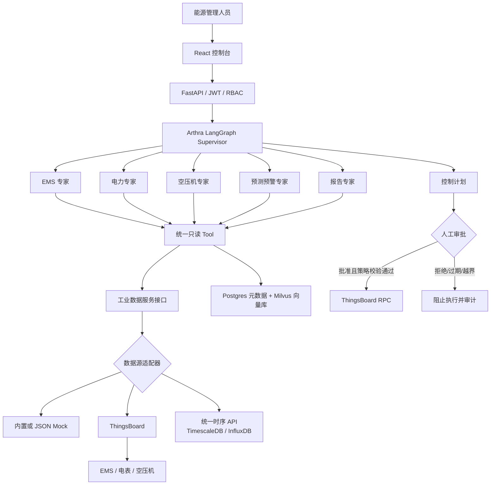

# Arthra AI 能碳大脑

Arthra 是一个以 **LangGraph 多专家编排**和**统一工业数据接口**为主线的能碳管理 MVP。它将 EMS、电力、空压机、预测预警和报告专家组织成可持久化工作流，读取侧可切换 ThingsBoard、Mock 或统一时序 API，并在任何设备控制之前强制进入人工审批。

## 架构总览



迁移期间公开 API、SSE 事件、数据库表、checkpoint namespace、工业数据协议与控制审批链保持兼容。`energy-data` 仅能读取经授权的设备数据；控制 RPC 仍只由 `ControlService` 在人工审批后执行。详情见 [目标架构](docs/architecture/target-architecture.md)、[MCP 工具说明](docs/tools/energy-data-mcp.md) 和 [迁移运行手册](docs/operations/migration-runbook.md)。

## 核心能力

| 能力 | MVP 实现 |
| --- | --- |
| 能力识别 | “问题模式 → 业务领域 → 专业意图”三级路由；高置信受控问法优先匹配，未登记问题使用 OpenAI-compatible 语义分类，全部结果经过 Pydantic 校验 |
| 工业数据 | 统一设备、遥测、属性、告警协议，可配置 ThingsBoard、内置/文件 Mock、通用时序 API |
| 知识库 / RAG | `knowledge` 存放知识资产，Postgres 保存文档元数据和分片正文，Milvus 保存 chunk 向量 |
| AI 每日摘要 | 聚合最近 24 小时遥测、告警与确定性规则，每天自动生成并支持手动刷新 |
| 空压专家 | 实时状态、周期电量、加载/卸载率、空载、启停、压力、高压、比功率、群控、泄漏、节能筛查与效果验证 |
| 电力专家 | 实时功率、周期电量、同期比较、15 分钟需量、峰值、峰均比、越限、电压、不平衡、功率因数、THD、谐波和异常持续时间 |
| 安全控制 | 控制计划白名单、参数限幅、10 分钟有效期、RBAC 审批、全链路审计 |
| 控制台 | 能源总览、每日摘要、SSE 对话、知识库、控制审批和审计页面 |

## 目录地图

```text
apps/api/                         FastAPI、兼容路由、数据模型与 Alembic
apps/api/arthra/industrial_data/  统一工业数据模型、Protocol、服务、工厂和适配器
apps/api/arthra/compressor/       空压系统上下文、确定性算法和只读工具
apps/api/arthra/power/            电力数据上下文、需量/电能质量确定性算法和只读工具
apps/arthra-gateway/              外部 FastAPI、JWT、RBAC、SSE 与用户线程
apps/arthra-orchestrator/         LangGraph Checkpoint、主图与 Agent 插件装配
apps/arthra-scheduler/            每日洞察与定时任务
apps/web/                         React + TypeScript 控制台
agents/*                          Agent 配置、知识域和插件描述
packages/rag/                     RAG 摄取、检索、引用组装和向量库适配代码
knowledge/                        原始知识资产、解析产物、人工元数据和入库记录
dataset/                          Agent、RAG 与回归评测数据
docs/                             架构、运维、工具和协作说明
```

更多目录边界见 [docs/README.md](docs/README.md)。

## 快速启动

本项目提供两类启动方式：

- 轻量调试：`start-lr.command`（macOS）或 `start-lr-windows.cmd`（Windows），使用 LR Python 环境、SQLite 临时库和 mock 工业数据，不需要 Docker、PostgreSQL 或 ThingsBoard。
- 完整栈：`docker compose up -d --build`，启动 PostgreSQL、Milvus、ThingsBoard、API、前端和模拟器。

首次在新电脑运行前，先准备 Python 3.12、Node.js、pnpm，并执行：

```zsh
pnpm --dir apps/web install
cp .env.example .env
```

Windows 可用 PowerShell：

```powershell
pnpm --dir apps/web install
Copy-Item .env.example .env
```

轻量启动：

```zsh
chmod +x ./start-lr.command
./start-lr.command
```

Windows 轻量启动：

```powershell
.\start-lr-windows.cmd
```

Docker 完整栈：

```powershell
docker compose up -d --build
docker compose ps
```

默认访问地址：

- Arthra 控制台：[http://127.0.0.1:18090](http://127.0.0.1:18090)
- Arthra API/Swagger：[http://127.0.0.1:18089/docs](http://127.0.0.1:18089/docs)
- OpenAPI JSON：[http://127.0.0.1:18089/openapi.json](http://127.0.0.1:18089/openapi.json)
- ThingsBoard（完整栈）：[http://localhost:9090](http://localhost:9090)

演示账号：

| 系统 | 账号 | 密码 |
| --- | --- | --- |
| Arthra | `admin@arthra.local` | `Arthra@123456` |
| ThingsBoard Tenant | `tenant@thingsboard.org` | `tenant` |

轻量脚本会自动使用自身目录作为项目根目录、临时覆盖为 mock 数据源、自动打开前端；macOS 下会在 Vite/esbuild 因本地签名问题无法执行时尝试自动修复。完整启动、模型、Ollama、环境变量和排障细节见 [本地运行手册](docs/operations/local-runbook.md)。

## 关键配置

`.env.example` 复制为 `.env` 后至少检查：

| 配置 | 用途 |
| --- | --- |
| `APP_SECRET_KEY` | 任何共享或部署环境必须换成长随机值 |
| `BOOTSTRAP_ADMIN_EMAIL` / `BOOTSTRAP_ADMIN_PASSWORD` | 启动时创建默认管理员 |
| `CORS_ORIGINS` / `VITE_API_BASE_URL` | 前端与 API 地址 |
| `DATABASE_URL` / `LANGGRAPH_DATABASE_URL` | 业务数据库和 LangGraph checkpoint |
| `INDUSTRIAL_DATA_PROVIDER` | `thingsboard`、`mock` 或 `timeseries_api` |
| `INDUSTRIAL_DATA_MOCK_FILE` | 可选 JSON Mock 数据文件；空值使用内置确定性数据 |
| `TIMESERIES_API_URL` / `TIMESERIES_API_TOKEN` | 接入自建时序服务 |
| `LLM_API_KEY` / `LLM_BASE_URL` / `LLM_MODEL` | OpenAI-compatible 对话模型 |
| `EMBEDDING_API_KEY` / `EMBEDDING_BASE_URL` / `EMBEDDING_MODEL` / `EMBEDDING_DIMENSIONS` | RAG embedding；默认维度 384 |
| `MILVUS_URI` / `MILVUS_TOKEN` / `MILVUS_COLLECTION` | RAG 向量库 |
| `DAILY_SUMMARY_ENABLED` / `DAILY_SUMMARY_HOUR` / `DAILY_SUMMARY_TIMEZONE` | 每日摘要定时任务 |

完整配置说明见 [本地运行手册](docs/operations/local-runbook.md)。

## 演示/Mock 到真实系统维护地图

当前需要后续真实化维护的内容集中在以下位置：

| 项 | 当前位置 | 替换维护方式 |
| --- | --- | --- |
| 工业 mock 数据 | `apps/api/arthra/industrial_data/adapters/mock_file.py` | 用 `INDUSTRIAL_DATA_MOCK_FILE` 指向 JSON 文件做过渡；生产推荐切到 `thingsboard` 或 `timeseries_api` |
| AI 负荷预测 mock | `GET /api/v1/load-forecast/mock` 和 `apps/web/src/App.tsx` | 新增真实 forecast service/API 后替换前端调用，不再使用静态预测曲线 |
| 工厂能耗分析 / 每日摘要 | `apps/api/arthra/daily_summary.py` | 算法读取统一工业数据接口；真实化优先切换工业数据源，不让摘要直接读外部数据库 |
| 能量风险预警 | `apps/api/arthra/power/*` 和首页洞察卡片 | 需量和电能质量来自确定性工具；预测风险需等待真实负荷预测服务 |
| 空压和电力算法 | `apps/api/arthra/compressor/*`、`apps/api/arthra/power/*` | 阈值优先通过配置维护，pointCode 映射在适配器或时序 API 边界完成 |
| RAG 知识资产 | `knowledge/raw`、`knowledge/metadata` | 原始资产人工维护；运行时通过知识 API 入库 |
| RAG 向量库 | Postgres 元数据 + Milvus chunk 向量 | 生产备份必须同时覆盖 Postgres 与 Milvus；embedding 维度需与 collection 一致；旧 pgvector 数据不会自动回填 |
| 后端 API 集成 | `/api/v1`、`/openapi.json`、`apps/api/arthra/api.py` | 给第三方界面集成时以 OpenAPI 为契约，保留 JWT、租户、工厂和 RBAC 边界 |

推荐替换顺序：先替换工业数据源，再替换 AI 负荷预测，再维护真实 RAG/Embedding/Milvus，最后校准算法阈值和 pointCode 映射。完整维护说明见 [真实数据维护手册](docs/operations/real-data-maintenance.md)。

## 知识库与 RAG 边界

`knowledge` 是知识资产目录，不是向量数据库。Agent 不直接读取 `knowledge`、不直接连接 Milvus，也不在自身目录实现 `load_pdf()` 或 `search_vector()`；它们只能通过 `arthra_rag.retrieve(...)` 或受控 RAG Tool 检索知识。

多 Agent 检索范围通过各 Agent 的 `config.yaml` 声明。客户知识放在 `knowledge/raw/customer/<customer_slug>/`，入库和检索必须带 `tenant_id` 与 `factory_id`。Postgres 保存文档、分片正文、租户/工厂权限和列表元数据；Milvus 保存 chunk 向量、过滤字段和向量索引。旧 pgvector 数据升级到 Milvus 后不会自动回填历史向量；已有文档需要重新上传或单独执行回填脚本。更多边界说明见 [RAG 与知识资产边界](docs/architecture/rag-knowledge-boundary.md)。

## 统一工业数据与算法边界

Agent 和专家工具只依赖 `IndustrialDataService`，不会导入 ThingsBoard、TimescaleDB 或 InfluxDB 客户端。统一时序 API 需要实现 `/devices`、`/devices/{id}/telemetry/latest`、`/devices/{id}/telemetry/history`、`/devices/{id}/attributes`、`/devices/{id}/alarms`。

底层字段名不一致时，应在时序 API 或适配器内映射为 Arthra pointCode，例如 `active_power_kw -> meter_TotW`。单位换算、缺失值处理、聚合语义和阈值判定不得交给 Agent 或 LLM。空压机、电力和定向问答工具清单见 [领域确定性工具说明](docs/tools/domain-analysis-tools.md)。

## 后端 API 集成

公开 API 入口：

- Swagger：[http://localhost:18089/docs](http://localhost:18089/docs)
- OpenAPI JSON：[http://localhost:18089/openapi.json](http://localhost:18089/openapi.json)
- 健康检查：`GET /api/v1/health`

常用集成接口：

| 能力 | 接口 |
| --- | --- |
| 登录 | `POST /api/v1/auth/login` |
| 当前用户 | `GET /api/v1/auth/me` |
| 工厂 | `GET /api/v1/factories` |
| 设备 | `GET /api/v1/devices` |
| 遥测 | `GET /api/v1/devices/{device_id}/telemetry` |
| 告警 | `GET /api/v1/devices/{device_id}/alarms` |
| Agent 对话 | `POST /api/v1/chat` |
| 知识库 | `/api/v1/knowledge/...` |
| 控制计划 | `/api/v1/control-plans...` |

API 路由主要在 `apps/api/arthra/api.py`，Gateway 工厂在 `apps/arthra-gateway/src/arthra_gateway/app.py`。第三方界面集成时应以 `/openapi.json` 为契约，并保留 JWT、租户、工厂和角色权限。

## 本地开发和测试

```powershell
uv sync --dev
uv run alembic -c apps/api/alembic.ini upgrade head
uv run uvicorn arthra.main:app --app-dir apps/api --reload

pnpm --dir apps/web install
pnpm --dir apps/web dev

uv run pytest
uv run ruff check apps services tests
pnpm --dir apps/web build
```

改动后至少运行受影响模块测试；修改公共 API、控制状态机、迁移或前端类型时运行完整测试和前端构建。

## 安全边界

- LLM 永远不能访问 ThingsBoard 凭据或原始 RPC 客户端。
- Agent 只能提出控制计划，不能批准或直接执行。
- 每次批准前重新执行白名单、限幅、有效期和状态校验。
- 控制事件记录操作者、计划、参数、结果与时间；API 不提供删除审计记录的接口。
- 演示密码和本地 JWT 密钥不适用于生产环境。
- 自动闭环、多租户、SSO 和高可用不在当前 MVP 范围内。

## 更多文档

- [Docs 目录索引](docs/README.md)
- [本地运行手册](docs/operations/local-runbook.md)
- [真实数据维护手册](docs/operations/real-data-maintenance.md)
- [领域确定性工具说明](docs/tools/domain-analysis-tools.md)
- [Codex 协作提示词](docs/agents/codex-prompts.md)
- [目标架构](docs/architecture/target-architecture.md)
- [RAG 与知识资产边界](docs/architecture/rag-knowledge-boundary.md)
- [迁移运行手册](docs/operations/migration-runbook.md)
