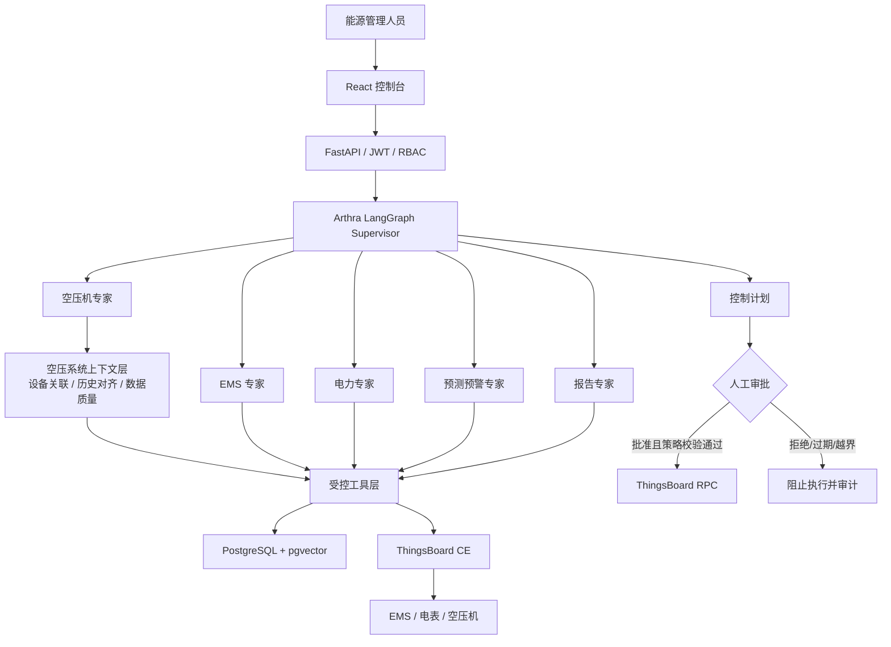

# Arthra AI 能碳大脑

Arthra 是一个以 **LangGraph 多专家编排**和 **ThingsBoard IoT** 为主线的能碳管理 MVP。它将 EMS、电力、空压机、预测预警和报告专家组织成可持久化工作流，并在任何设备控制之前强制进入人工审批。

## 架构



## 功能

| 能力 | MVP 实现 |
| --- | --- |
| 能力识别 | Qwen/OpenAI-compatible 语义分类，Pydantic 校验后进入五类专家；低置信度或模型异常时关键词兜底 |
| 模型 | OpenAI-compatible 接口，可配置 OpenAI、Qwen、DeepSeek、Ollama 或 vLLM |
| 状态 | LangGraph PostgreSQL Checkpoint，线程由 `thread_id` 隔离 |
| 知识库 | 文本切分、pgvector、相似度检索与引用接口 |
| IoT | ThingsBoard 设备、最新遥测、历史时序、告警和双向 RPC |
| 安全控制 | 白名单、参数限幅、10 分钟有效期、RBAC 审批、全链路审计 |
| 演示数据 | EMS、开山空压机和 ADL400 电表模拟器，按点表上报遥测/属性并响应 RPC |
| AI 每日摘要 | 聚合最近 24 小时遥测、告警与确定性规则，每天自动生成并支持手动刷新 |
| 空压系统上下文 | 按 `airSystemId` 关联空压机和电表，统一查询24小时历史、时间桶和数据质量 |
| 空压专家工具 | 加载/卸载率、空载、启停、压力波动、高压、比功率、泄漏与节能初筛 |
| 数据契约 | Pydantic v2 严格模型覆盖 API、Agent、ThingsBoard 投影、空压上下文、控制、日报、知识与审计；默认拒绝未知字段 |
| 控制台 | 能源总览、每日摘要、SSE 对话、知识库、控制审批和审计页面 |

## 目录

```text
apps/api/               FastAPI、LangGraph、数据模型与 Alembic
apps/api/arthra/contracts.py 共享严格模型、JSON/遥测值类型、告警与引用契约
apps/api/arthra/thingsboard_schemas.py ThingsBoard 外部响应投影与 RPC 契约
apps/api/arthra/agent_schemas.py 通用设备上下文和专家分析契约
apps/api/arthra/daily_schemas.py 每日摘要统计、设备、告警和快照契约
apps/api/arthra/compressor/ 空压系统上下文、质量检查、确定性特征和只读工具
apps/web/               React + TypeScript 控制台
services/simulator/     ThingsBoard 三设备遥测/RPC 模拟器
tests/                  路由、安全策略、知识切分与密码测试
docker-compose.yml      完整本地运行栈
.env.example            可提交的环境变量模板
AGENTS.md                Agent/开发者协作约束
```

## 环境要求

- Docker Desktop 与 Docker Compose v2
- 本地开发可选：Python 3.12、uv 0.11+、Node.js 24、pnpm 11
- 建议至少 8 GB 可用内存；ThingsBoard 首次初始化需要数分钟

> 当前 Windows 环境曾出现 Docker 无法读取 `C:\Users\Aethr\.docker\config.json` 的警告。若启动失败，请先在 Docker Desktop 中确认引擎已运行，并修复该文件的读取权限。项目不会自动删除或覆盖用户 Docker 配置。

## 一键启动

```powershell
Copy-Item .env.example .env
# 修改 .env 中的 APP_SECRET_KEY、管理员密码和可选模型配置
docker compose up -d --build
docker compose ps
```

本仓库已附带仅用于本地演示的 `.env`；任何共享或部署前都必须修改其中密钥。

启动完成后访问：

- Arthra 控制台：[http://localhost:8080](http://localhost:8080)
- Arthra API/Swagger：[http://localhost:8000/docs](http://localhost:8000/docs)
- ThingsBoard：[http://localhost:9090](http://localhost:9090)

默认演示账号：

| 系统 | 账号 | 密码 |
| --- | --- | --- |
| Arthra | `admin@arthra.local` | `Arthra@123456` |
| ThingsBoard Tenant | `tenant@thingsboard.org` | `tenant` |

查看日志或停止：

```powershell
docker compose logs -f api simulator thingsboard
docker compose down
```

## 模型配置

对话模型与嵌入模型独立配置。两者都遵循 OpenAI-compatible API：

```dotenv
LLM_API_KEY=your-key
LLM_BASE_URL=https://api.deepseek.com/v1
LLM_MODEL=deepseek-chat

# Supervisor 默认复用上述模型，也可单独指定更轻量的分类模型
SUPERVISOR_SEMANTIC_ROUTING_ENABLED=true
SUPERVISOR_LLM_MODEL=
SUPERVISOR_ROUTE_CONFIDENCE_THRESHOLD=0.65

EMBEDDING_API_KEY=your-embedding-key
EMBEDDING_BASE_URL=https://dashscope.aliyuncs.com/compatible-mode/v1
EMBEDDING_MODEL=text-embedding-v4
```

Supervisor 要求模型只返回 `ems / power / compressor / forecast / report` 之一，并使用 Pydantic 校验路由、置信度、理由和能力标签。模型返回非法 JSON、非法专家、置信度低于阈值或调用失败时，自动退回中文/英文关键词路由。未配置 `LLM_API_KEY` 时，平台、设备、路由和知识库仍能运行，对话会提示配置模型。未配置嵌入 API 时使用确定性的本地演示向量；生产环境应配置正式嵌入模型并保持 384 维，或同时修改迁移中的向量维度。

每日摘要默认按 `Asia/Shanghai` 时区在每天 08:00 自动生成，统计窗口为生成时刻向前 24 小时。可通过以下环境变量调整：

```dotenv
DAILY_SUMMARY_ENABLED=true
DAILY_SUMMARY_HOUR=8
DAILY_SUMMARY_TIMEZONE=Asia/Shanghai
```

摘要中的最小值、最大值、平均值、用电增量和规则提醒由 Python 确定性计算；LLM 只负责组织中文报告。模型不可用时仍会保存确定性摘要。

## API 示例

登录：

```powershell
$login = Invoke-RestMethod -Method Post -Uri http://localhost:8000/api/v1/auth/login `
  -ContentType application/json `
  -Body '{"email":"admin@arthra.local","password":"Arthra@123456"}'
$headers = @{ Authorization = "Bearer $($login.access_token)" }
Invoke-RestMethod http://localhost:8000/api/v1/devices -Headers $headers
```

调用空压系统上下文分析（`device_scope` 只需传空压机，系统会通过 `airSystemId` 自动关联电表）：

```powershell
$body = @{
  message = "分析加载率、空载、频繁启停、压力波动和比功率"
  device_scope = @("ThingsBoard-compressor-device-uuid")
  capabilities = @("load_rate", "idle_running", "frequent_start", "pressure_fluctuation", "specific_power")
} | ConvertTo-Json
Invoke-RestMethod -Method Post http://localhost:8000/api/v1/compressor-analysis `
  -Headers $headers -ContentType application/json -Body $body
```

默认查询最近24小时并使用3分钟聚合桶；上下文层会根据 ThingsBoard 的区间限制自动放大长窗口的桶宽。返回结果包含数据覆盖率、设备关系、确定性指标、证据、缺失项和置信度，原始时序不会发送给 LLM。

## Pydantic 数据契约

项目采用“外部投影 → 领域上下文 → 确定性结果 → API DTO”的分层契约。`StrictModel` 默认设置 `extra="forbid"` 和赋值校验；Qwen Supervisor 输出通过 `SemanticRouteOutput` 校验，ThingsBoard 设备、时序和告警通过外部投影模型解析，空压分析输出使用明确的指标、告警、建议和上下文模型。控制命令使用方法与参数配对模型，例如 `setPowerLimit` 只能接收 `{ "value": number }`，`start/stop` 只能接收空参数。

SQLAlchemy 继续负责数据库映射，不与 Pydantic 混用；JSON 列写入前使用严格模型序列化，读取 API 时使用 `from_attributes=True` 的 DTO。数学运算中的局部字典、LangGraph 节点更新映射和 HTTP 客户端参数不是业务数据契约，可以保留普通容器。

查看自动生成的 JSON Schema：

```powershell
Invoke-RestMethod http://localhost:8000/openapi.json
```

创建待审批控制计划：

```powershell
$body = @{
  device_id = "ThingsBoard-device-uuid"
  device_name = "Arthra-EMS-01"
  device_type = "ems"
  method = "setPowerLimit"
  params = @{ value = 300 }
  reason = "需量控制建议"
  risk_level = "medium"
} | ConvertTo-Json
Invoke-RestMethod -Method Post http://localhost:8000/api/v1/control-plans `
  -Headers $headers -ContentType application/json -Body $body
```

只有 `admin` 或 `approver` 能调用 `/control-plans/{id}/approve`。批准时系统会再次校验设备类型、方法、参数范围和有效期，之后才发送 RPC。

## 本地开发和测试

```powershell
$env:UV_CACHE_DIR='D:\aiagent\.uv-cache'
$env:UV_PYTHON_INSTALL_DIR='D:\aiagent\.uv-python'
uv sync --dev
uv run alembic -c apps/api/alembic.ini upgrade head
uv run uvicorn arthra.main:app --app-dir apps/api --reload

pnpm --dir apps/web install
pnpm --dir apps/web dev

uv run pytest
uv run ruff check apps services tests
pnpm --dir apps/web build
```

## 安全边界

- LLM 永远不能访问 ThingsBoard 凭据或原始 RPC 客户端。
- Agent 只能提出控制计划，不能批准或直接执行。
- 每次批准前重新执行白名单、限幅、有效期和状态校验。
- 控制事件记录操作者、计划、参数、结果与时间；API 不提供删除审计记录的接口。
- 演示密码和本地 JWT 密钥不适用于生产环境。
- 自动闭环、多租户、SSO 和高可用不在当前 MVP 范围内。

## 常见问题

**ThingsBoard 长时间未就绪？** 首次启动会初始化内部 PostgreSQL。运行 `docker compose logs -f thingsboard`，等待 Web 服务监听 9090 后模拟器会自动重试。

**设备列表为空？** 检查 `simulator` 日志。它会使用 Tenant 账号创建三台设备并通过设备 token 上报数据。

**模拟器包含哪些真实点表字段？** 开山空压机使用 `air_comp_*` 点，包括供气压力、排气温度、主机电流、运行/加载、维护时长以及原生故障和维护位；ADL400 使用 `meter_*` 点，包括三相电压/电流/功率、功率因数、频率、不平衡度、电能、需量、总谐波和 3/5/7 次谐波。专家按这些 pointCode 做确定性分析，不再依赖旧的通用字段名。

**批准后显示 failed？** 检查模拟器是否连接 1883 端口并订阅 RPC；失败会写入计划结果和审计记录，不会静默重试控制。

**如何清空演示数据？** `docker compose down -v` 会删除本项目 Compose 卷中的 Arthra 与 ThingsBoard 数据，此操作不可恢复。
