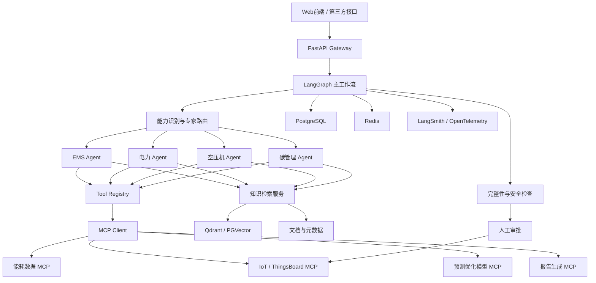
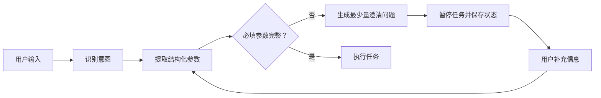
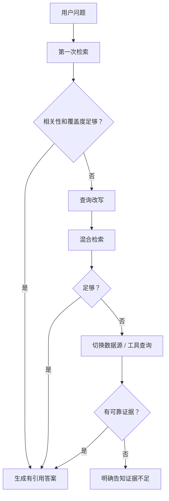
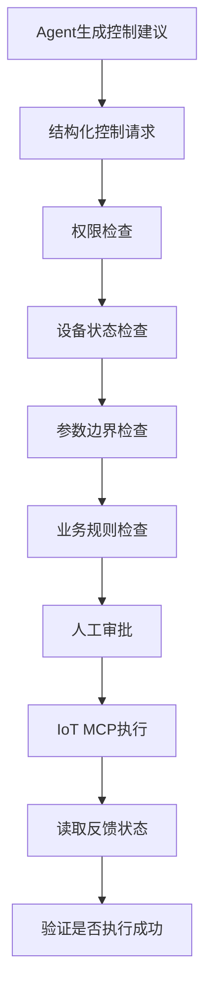

# 用 Codex 开发 LangChain「AI 能碳大脑」实战教程（gpt生成）

你的最佳路线不是一开始就写一个“万能 Agent”，而是：

> **LangChain 负责模型、工具和 RAG；LangGraph 负责流程、状态、分支、重试和人工审批；FastAPI 负责对外接口；PostgreSQL/Redis/向量数据库负责持久化；Codex 负责逐阶段生成、测试和维护代码。**

目前 LangChain 官方的 `create_agent` 已经建立在 LangGraph 之上。简单 Agent 可以先用 LangChain，涉及多专家路由、信息补全、召回重试、设备控制审批等复杂流程时，再显式使用 LangGraph。([Docs by LangChain][1])

---

## 一、先理解这几个组件分别做什么

| 组件              | 在项目中的职责                        |
| --------------- | ------------------------------ |
| LangChain       | 模型调用、提示词、Tools、Retriever、结构化输出 |
| LangGraph       | Agent工作流、状态、循环、条件分支、暂停恢复       |
| LangSmith       | 链路追踪、调试、数据集评测、线上监控             |
| FastAPI         | 对前端和其他系统提供HTTP接口               |
| PostgreSQL      | 用户、会话、设备、任务、报告等业务数据            |
| Redis           | 缓存、短期状态、任务锁、限流                 |
| Qdrant/PGVector | 知识库向量检索                        |
| MCP             | 将算法、IoT、数据库等能力标准化为工具           |
| Codex           | 编写代码、重构、测试、检查文档、执行命令           |

LangGraph 的基本概念只有三个：

1. **State**：当前任务的共享状态。
2. **Node**：处理步骤。
3. **Edge**：下一步去哪里。

这非常适合你的系统，因为能碳 Agent 本身就是一个状态机。([Docs by LangChain][2])

---

# 二、最终系统架构



---

# 三、项目不要直接做成一个大文件

推荐采用以下结构：

```text
arthra-agent/
├─ README.md
├─ AGENTS.md
├─ pyproject.toml
├─ uv.lock
├─ .env.example
├─ docker-compose.yml
├─ Makefile
│
├─ docs/
│  ├─ architecture.md
│  ├─ domain-model.md
│  ├─ agent-design.md
│  ├─ rag-design.md
│  ├─ tool-contracts.md
│  ├─ testing-strategy.md
│  └─ adr/
│     ├─ 001-use-langgraph.md
│     └─ 002-vector-database.md
│
├─ src/
│  └─ arthra/
│     ├─ app.py
│     ├─ config.py
│     │
│     ├─ api/
│     │  ├─ routes_chat.py
│     │  ├─ routes_health.py
│     │  └─ schemas.py
│     │
│     ├─ agents/
│     │  ├─ supervisor.py
│     │  ├─ ems_agent.py
│     │  ├─ power_agent.py
│     │  ├─ compressor_agent.py
│     │  └─ carbon_agent.py
│     │
│     ├─ graphs/
│     │  ├─ state.py
│     │  ├─ main_graph.py
│     │  ├─ rag_graph.py
│     │  └─ control_graph.py
│     │
│     ├─ prompts/
│     │  ├─ supervisor.md
│     │  ├─ ems.md
│     │  ├─ power.md
│     │  └─ clarification.md
│     │
│     ├─ knowledge/
│     │  ├─ ingest.py
│     │  ├─ loaders.py
│     │  ├─ splitter.py
│     │  ├─ retriever.py
│     │  ├─ reranker.py
│     │  └─ evaluation.py
│     │
│     ├─ tools/
│     │  ├─ registry.py
│     │  ├─ energy_tools.py
│     │  ├─ device_tools.py
│     │  ├─ carbon_tools.py
│     │  └─ report_tools.py
│     │
│     ├─ mcp/
│     │  ├─ client.py
│     │  ├─ servers.py
│     │  └─ adapters.py
│     │
│     ├─ context/
│     │  ├─ conversation.py
│     │  ├─ compression.py
│     │  ├─ memory.py
│     │  └─ budgets.py
│     │
│     ├─ guardrails/
│     │  ├─ input_validation.py
│     │  ├─ output_validation.py
│     │  ├─ permissions.py
│     │  └─ control_safety.py
│     │
│     ├─ services/
│     │  ├─ llm.py
│     │  ├─ telemetry.py
│     │  └─ report.py
│     │
│     └─ storage/
│        ├─ postgres.py
│        ├─ redis.py
│        └─ vector_store.py
│
├─ mcp_servers/
│  ├─ energy_data/
│  ├─ prediction/
│  ├─ carbon/
│  └─ iot_control/
│
├─ tests/
│  ├─ unit/
│  ├─ integration/
│  ├─ evaluation/
│  ├─ security/
│  └─ fixtures/
│
├─ datasets/
│  ├─ rag_eval/
│  ├─ agent_eval/
│  └─ regression/
│
├─ scripts/
│  ├─ ingest_knowledge.py
│  ├─ run_evaluation.py
│  └─ seed_demo_data.py
│
└─ deployments/
   ├─ docker/
   └─ k8s/
```

核心原则是：

* `agents` 放专家定义。
* `graphs` 放流程和状态。
* `tools` 放本地工具。
* `mcp_servers` 放可独立部署的能力。
* `knowledge` 只负责知识库。
* `context` 只负责上下文。
* `guardrails` 负责安全和校验。
* 专业算法不要直接埋在 Prompt 中。

---

# 四、让 Codex 先读到最新 LangChain 文档

LangChain 官方提供了文档 MCP Server，可以直接接入 Codex：

```bash
codex mcp add langchain-docs --url https://docs.langchain.com/mcp
```

这是官方文档目前提供的 Codex CLI 接入方式。接入后，Codex 可以查询最新 LangChain、LangGraph 和 LangSmith 文档，减少生成旧版 API 的概率。([Docs by LangChain][3])

然后告诉 Codex：

```text
在实现任何 LangChain 或 LangGraph API 前，先查询 langchain-docs MCP。
不要根据旧版记忆使用已废弃 API。
优先使用当前 Python 官方文档中的 create_agent、StateGraph、
checkpointer、middleware 和 langchain-mcp-adapters。
```

---

# 五、创建 Codex 项目协作说明

在根目录建立 `AGENTS.md`。

```markdown
# Arthra Agent Development Guide

## Project goal

Build an AI energy and carbon management system using:

- Python 3.12
- LangChain
- LangGraph
- FastAPI
- PostgreSQL
- Redis
- Qdrant or pgvector
- MCP
- pytest

## Architecture rules

1. LangGraph nodes must be small and independently testable.
2. Domain calculations must not be implemented by the LLM.
3. All calculations must use deterministic Python tools.
4. Device-control tools require validation and approval.
5. Never allow an LLM to construct arbitrary SQL.
6. Every tool input and output must use Pydantic schemas.
7. Retrieval answers must include source metadata.
8. If evidence is insufficient, the system must say so.
9. Do not silently fabricate missing device, time-range, site, or metric data.
10. Prompts must be stored under src/arthra/prompts.

## Development workflow

Before changing code:

1. Read relevant documentation.
2. Inspect existing tests.
3. Write or update tests.
4. Implement the smallest change.
5. Run lint, type checking, and tests.
6. Update docs and changelog.

## Required commands

- `uv run ruff check .`
- `uv run mypy src`
- `uv run pytest`
- `uv run pytest tests/evaluation`
```

这份文件非常重要。它相当于给 Codex 定义了长期开发规范。

---

# 六、第一阶段：先做最小可运行 Agent

不要马上做多 Agent、RAG 和 MCP。

第一阶段只做：

```text
用户问题
→ 模型判断
→ 调用一个工具
→ 返回结构化答案
```

安装基础依赖：

```bash
uv init
uv add langchain langgraph langchain-openai
uv add fastapi uvicorn pydantic pydantic-settings
uv add pytest pytest-asyncio ruff mypy
```

模型层统一封装：

```python
# src/arthra/services/llm.py

from functools import lru_cache

from langchain.chat_models import init_chat_model
from langchain_core.language_models.chat_models import BaseChatModel

from arthra.config import Settings, get_settings


@lru_cache
def get_chat_model() -> BaseChatModel:
    settings: Settings = get_settings()

    return init_chat_model(
        model=settings.model_name,
        model_provider=settings.model_provider,
        temperature=0,
    )
```

不要让业务代码直接写：

```python
ChatOpenAI(...)
```

否则以后切换 Qwen、DeepSeek、自研模型时，会修改很多地方。

---

## 第一个能碳工具

```python
from langchain.tools import tool
from pydantic import BaseModel, Field


class CarbonInput(BaseModel):
    electricity_kwh: float = Field(ge=0)
    emission_factor: float = Field(gt=0)


@tool(args_schema=CarbonInput)
def calculate_electricity_carbon(
    electricity_kwh: float,
    emission_factor: float,
) -> dict[str, float]:
    """Calculate electricity-related carbon emissions.

    Use only when electricity consumption and an applicable
    emission factor are explicitly available.
    """

    emission_kg = electricity_kwh * emission_factor

    return {
        "electricity_kwh": electricity_kwh,
        "emission_factor": emission_factor,
        "emission_kg_co2e": emission_kg,
    }
```

创建 Agent：

```python
from langchain.agents import create_agent

from arthra.services.llm import get_chat_model
from arthra.tools.carbon_tools import calculate_electricity_carbon


agent = create_agent(
    model=get_chat_model(),
    tools=[calculate_electricity_carbon],
    system_prompt="""
You are an energy and carbon management assistant.

Rules:
1. Do not invent measurements or emission factors.
2. Use tools for numerical calculations.
3. State assumptions explicitly.
4. Ask for missing mandatory information.
5. Respond in Chinese unless requested otherwise.
""",
)
```

`create_agent` 是当前 LangChain 官方提供的较高层 Agent 接口，底层使用 LangGraph 的图式运行机制。([Docs by LangChain][4])

---

# 七、第二阶段：用 LangGraph 搭建主流程

你的主流程不应只是：

```text
LLM ↔ Tools
```

应该明确拆成：

```text
输入校验
→ 信息完整性检查
→ 能力识别
→ 专家路由
→ 检索/工具执行
→ 证据校验
→ 输出生成
→ 安全校验
```

## 定义状态

```python
from typing import Annotated, Literal, TypedDict

from langgraph.graph.message import add_messages
from langchain_core.messages import AnyMessage


class ArthraState(TypedDict, total=False):
    messages: Annotated[list[AnyMessage], add_messages]

    user_id: str
    session_id: str
    site_id: str | None

    intent: Literal[
        "energy_analysis",
        "power_analysis",
        "compressor_analysis",
        "carbon_analysis",
        "device_control",
        "general",
    ]

    required_fields: list[str]
    missing_fields: list[str]

    retrieved_documents: list[dict]
    retrieval_score: float
    retrieval_attempts: int

    tool_results: list[dict]
    evidence_sufficient: bool

    requires_approval: bool
    approved: bool

    final_answer: str
    errors: list[str]
```

注意：State 中保存的是**任务可观察状态**，不是模型私有思维链。

---

## 主图示意

```python
from langgraph.graph import END, START, StateGraph

from arthra.graphs.state import ArthraState


def build_main_graph():
    graph = StateGraph(ArthraState)

    graph.add_node("validate_input", validate_input)
    graph.add_node("classify_intent", classify_intent)
    graph.add_node("check_required_fields", check_required_fields)
    graph.add_node("ask_for_clarification", ask_for_clarification)
    graph.add_node("route_expert", route_expert)
    graph.add_node("validate_evidence", validate_evidence)
    graph.add_node("generate_answer", generate_answer)
    graph.add_node("validate_output", validate_output)

    graph.add_edge(START, "validate_input")
    graph.add_edge("validate_input", "classify_intent")
    graph.add_edge("classify_intent", "check_required_fields")

    graph.add_conditional_edges(
        "check_required_fields",
        route_after_field_check,
        {
            "missing": "ask_for_clarification",
            "complete": "route_expert",
        },
    )

    graph.add_edge("ask_for_clarification", END)
    graph.add_edge("route_expert", "validate_evidence")
    graph.add_edge("validate_evidence", "generate_answer")
    graph.add_edge("generate_answer", "validate_output")
    graph.add_edge("validate_output", END)

    return graph.compile()
```

LangGraph 特别适合这种可控的、需要条件分支的工作流，并支持持久化、人工介入和中断恢复。([Docs by LangChain][1])

---

# 八、用户信息不全时怎么处理

这是能碳项目里必须显式设计的功能，不能只在 Prompt 里写一句“信息不全就询问”。

例如用户说：

> 帮我分析一下昨天的能耗是否正常。

系统至少缺少：

* 哪个园区？
* 哪栋楼或哪个设备？
* 能源类型是什么？
* “正常”的比较基准是什么？

## 正确流程



## 不同意图定义不同必填字段

```python
REQUIRED_FIELDS = {
    "energy_analysis": ["site_id", "time_range", "metric"],
    "power_analysis": ["site_id", "time_range", "measurement_point"],
    "compressor_analysis": ["site_id", "compressor_ids", "time_range"],
    "carbon_analysis": ["organization_id", "accounting_period", "scope"],
    "device_control": [
        "site_id",
        "device_id",
        "action",
        "target_value",
    ],
}
```

## 不要让 LLM 自由判断完整性

使用结构化模型：

```python
from pydantic import BaseModel, Field


class EnergyAnalysisRequest(BaseModel):
    site_id: str | None = None
    time_range: str | None = None
    metric: str | None = None
    comparison_baseline: str | None = None
    user_goal: str | None = None


class CompletenessResult(BaseModel):
    complete: bool
    missing_fields: list[str] = Field(default_factory=list)
    clarification_question: str | None = None
```

然后由代码再次校验：

```python
def find_missing_fields(request: EnergyAnalysisRequest) -> list[str]:
    required = ["site_id", "time_range", "metric"]

    return [
        field_name
        for field_name in required
        if not getattr(request, field_name)
    ]
```

## 澄清问题原则

一次只问必要的问题，而且优先利用系统已经知道的信息：

不推荐：

> 请提供园区、设备、时间范围、能源种类、基准、用途和期望输出格式。

推荐：

> 需要分析哪个园区？当前系统中可选择 A 园区和 B 园区。

得到答案后再检查下一项。

对于设备控制，缺少任何关键参数都禁止执行。

---

# 九、知识库应该怎么搭建

LangChain 官方把 RAG 拆成：

```text
Document Loader
→ Text Splitter
→ Embedding
→ Vector Store
→ Retriever
→ Generation
```

并区分固定的 2-step RAG、Agentic RAG 和带查询改写、检索校验的 Hybrid RAG。你的能碳系统更适合采用 **Hybrid RAG**。([Docs by LangChain][5])

---

## 1. 知识库不要混在一个集合中

建议分库或至少按 metadata 严格分区：

```text
knowledge_base/
├─ standards
│  ├─ 国家标准
│  ├─ 行业标准
│  └─ 地方标准
├─ equipment
│  ├─ 空压机手册
│  ├─ 储能手册
│  └─ 电表手册
├─ operations
│  ├─ SOP
│  ├─ 应急预案
│  └─ 运维案例
├─ carbon
│  ├─ 排放因子
│  ├─ 核算规范
│  └─ 企业边界
└─ project
   ├─ 园区配置
   ├─ 设备台账
   └─ 历史报告
```

不要把设备实时数据放进向量数据库。实时数据应通过 SQL、时序数据库或 API 工具查询。

---

## 2. 每个文档必须带元数据

```python
metadata = {
    "document_id": "GB-XXXXX",
    "title": "某能源管理标准",
    "document_type": "standard",
    "domain": "energy_management",
    "version": "2025",
    "effective_date": "2025-01-01",
    "source": "official",
    "site_id": None,
    "device_model": None,
    "confidentiality": "internal",
    "page": 15,
}
```

元数据用于：

* 权限过滤
* 园区过滤
* 设备型号过滤
* 标准版本过滤
* 过期文档排除
* 引用来源展示

---

## 3. 分块不要固定一个数字解决所有文档

不同资料应采用不同策略：

| 文档类型 | 分块方法        |
| ---- | ----------- |
| 标准法规 | 按章、节、条款     |
| 设备手册 | 按标题和功能章节    |
| 故障案例 | 每个案例一个语义单元  |
| 表格   | 表头与数据行绑定    |
| 操作规程 | 按操作步骤和风险提示  |
| 历史报告 | 按结论、原因、建议分块 |

初期可以使用：

```python
RecursiveCharacterTextSplitter(
    chunk_size=800,
    chunk_overlap=120,
)
```

但这只是基线，后续要通过检索评测调整。

---

## 4. 采用混合检索

只使用向量相似度经常会漏掉：

* 设备编码
* 标准编号
* 告警代码
* 型号
* 专有名词
* 数字参数

推荐：

```text
Dense Vector Retrieval
+
BM25 Keyword Retrieval
+
Metadata Filtering
+
Reranker
```

例如用户搜索：

> GA75 空压机 E104 故障

关键词检索对 `GA75` 和 `E104` 通常比纯语义向量更重要。

---

# 十、召回失败怎么办

不能把“没有检索到”直接交给 LLM 自由回答。

建议设计一个检索闭环：



Hybrid RAG 本身就适合加入查询增强、检索验证和答案验证。([Docs by LangChain][5])

---

## 召回失败的判定不能只看向量分数

至少检查：

```python
class RetrievalAssessment(BaseModel):
    relevant: bool
    sufficient: bool
    covered_aspects: list[str]
    missing_aspects: list[str]
    reason: str
```

例如用户问：

> 这台空压机能耗高的原因是什么？

召回结果只包含“如何清洗过滤器”，但没有：

* 当前运行数据
* 排气压力
* 加载率
* 比功率
* 环境温度
* 历史基线

虽然文档相关，但证据并不充分。

---

## 推荐的失败处理顺序

### 第一级：查询标准化

```text
“昨天空压机费电吗？”
↓
site_id=xxx
equipment_type=air_compressor
time_range=昨天
metric=specific_power
task=anomaly_detection
```

### 第二级：多查询改写

生成多个检索查询：

```text
空压机比功率异常原因
空压机低加载率能耗
空压机排气压力与功耗
该型号空压机节能诊断
```

### 第三级：混合召回

同时做：

* 向量搜索
* 关键词搜索
* 元数据过滤
* 数据库查询

### 第四级：扩大检索范围

先查：

```text
具体设备型号资料
```

没有结果再查：

```text
同系列设备
```

最后才查：

```text
通用空压机知识
```

回答中必须标注证据级别。

### 第五级：向用户补充询问

例如：

> 当前知识库只有该型号的操作手册，缺少运行数据。请确认需要做一般原因分析，还是上传最近24小时功率、压力和加载率数据后做设备诊断？

### 第六级：安全失败

最终答复：

> 当前资料不足以判断具体原因。已找到通用故障机制，但无法确认是否适用于该设备。

不能让模型为了“必须有答案”而编造结论。

---

# 十一、Tools 应该怎么设计

## Tool不是普通函数暴露给模型

工具需要明确：

* 什么时候使用
* 不能什么时候使用
* 输入结构
* 输出结构
* 错误类型
* 权限要求
* 是否幂等
* 是否有副作用
* 超时和重试策略

---

## 好工具与坏工具

坏工具：

```python
@tool
def query_database(query: str):
    ...
```

模型可以自由生成 SQL，风险很高。

好工具：

```python
class EnergyQueryInput(BaseModel):
    site_id: str
    meter_ids: list[str]
    start_time: datetime
    end_time: datetime
    aggregation: Literal["5m", "15m", "1h", "1d"]
    metric: Literal["power_kw", "energy_kwh", "voltage", "current"]


@tool(args_schema=EnergyQueryInput)
def query_energy_timeseries(...):
    """Query validated energy telemetry.

    This tool is read-only.
    The time range must not exceed 31 days.
    """
```

---

## 工具分类

### 只读工具

```text
get_site_information
query_energy_timeseries
get_device_status
retrieve_equipment_manual
get_emission_factor
```

### 计算工具

```text
calculate_carbon_emissions
calculate_specific_power
calculate_peak_valley_cost
detect_energy_anomaly
forecast_load
optimize_storage_schedule
```

### 写入工具

```text
create_alarm
create_report
save_analysis_task
```

### 高风险控制工具

```text
set_compressor_pressure
start_storage_dispatch
stop_device
change_control_strategy
```

高风险工具必须走独立控制图，不允许普通 Agent 直接调用。

---

# 十二、MCP 应该如何使用

MCP 的价值是将不同服务统一暴露为工具。LangChain Python 可以通过 `langchain-mcp-adapters` 使用一个或多个 MCP Server。官方的 `MultiServerMCPClient` 默认按无状态方式创建会话，也支持进一步配置有状态会话。([Docs by LangChain][6])

安装：

```bash
uv add langchain-mcp-adapters
```

客户端示意：

```python
from langchain_mcp_adapters.client import MultiServerMCPClient


async def load_mcp_tools():
    client = MultiServerMCPClient(
        {
            "energy-data": {
                "transport": "streamable_http",
                "url": "http://energy-data-mcp:8001/mcp",
            },
            "prediction": {
                "transport": "streamable_http",
                "url": "http://prediction-mcp:8002/mcp",
            },
            "iot": {
                "transport": "streamable_http",
                "url": "http://iot-mcp:8003/mcp",
            },
        }
    )

    return await client.get_tools()
```

---

## 什么能力应该做成 MCP

适合 MCP：

* ThingsBoard 数据访问
* IoT设备查询
* 预测模型调用
* 碳排放因子查询
* 报告生成
* 企业内部数据库访问
* 第三方天气、电价等服务

不必做成 MCP：

* 简单文本格式化
* Agent 内部的小函数
* 纯状态判断
* 单项目独占、不会被复用的轻量逻辑

建议先写成本地 LangChain Tool，稳定后再拆为 MCP 服务。

---

# 十三、Context 应该怎么管理

你写的 `COTEXT` 应该是 `Context`。

Context 不是把全部聊天记录、全部知识文档、全部工具结果都塞给模型。

应分为五层：

```text
1. System Context
   角色、规则、安全约束

2. Task Context
   当前任务、已知参数、缺失参数

3. Conversation Context
   当前会话中必要的历史消息

4. Retrieved Context
   本次检索到的知识片段

5. Tool Context
   实时数据、计算结果和设备状态
```

---

## 不要保存或依赖模型隐式思维链

项目中应该保存：

* 用户输入
* 意图分类
* 提取出的参数
* 调用了什么工具
* 工具输入和输出
* 检索了哪些文档
* 最终结论
* 错误和重试
* 人工审批记录

不需要保存模型内部的私有逐步推理文本。

可观察的决策记录可以写成：

```json
{
  "decision": "request_more_information",
  "reason_code": "MISSING_TIME_RANGE",
  "missing_fields": ["start_time", "end_time"],
  "next_action": "ask_clarification"
}
```

这比保存冗长的模型“思考过程”更稳定、更安全，也更容易测试。

---

## 上下文预算

建议为每类内容设置上限：

```python
class ContextBudget(BaseModel):
    system_tokens: int = 1800
    conversation_tokens: int = 2500
    retrieved_tokens: int = 5000
    tool_result_tokens: int = 3000
    output_tokens: int = 1800
```

超过预算时：

1. 删除无关对话。
2. 将历史消息压缩成事实摘要。
3. 工具结果只保留必要字段。
4. 检索片段按相关性截断。
5. 永远保留关键安全指令和用户当前目标。

---

## 会话摘要应该保存事实而非措辞

```json
{
  "site_id": "site-a",
  "selected_devices": ["compressor-01", "compressor-02"],
  "time_range": {
    "start": "2026-07-17T00:00:00+08:00",
    "end": "2026-07-17T23:59:59+08:00"
  },
  "user_goal": "分析空压机能效异常",
  "confirmed_assumptions": [
    "以过去30天同班次中位数作为基准"
  ],
  "pending_questions": []
}
```

不要只保存：

> 用户之前和助手讨论了空压机的情况。

后者无法可靠复用。

---

# 十四、多 Agent 如何设计

一开始不要做多个 Agent 自由对话。

使用一个 Supervisor 加多个专家子图：

```text
Supervisor
├─ EMS Agent
├─ Power Agent
├─ Compressor Agent
├─ Carbon Agent
└─ General Agent
```

Supervisor 只负责：

* 分类
* 路由
* 合并结果
* 冲突处理

专家 Agent 负责：

* 领域知识
* 领域工具
* 领域输出格式

不要让所有专家拥有全部工具。

例如：

```python
AGENT_TOOLSETS = {
    "compressor": [
        get_compressor_status,
        query_compressor_timeseries,
        calculate_specific_power,
        retrieve_compressor_manual,
    ],
    "carbon": [
        get_emission_factor,
        calculate_carbon_emissions,
        query_activity_data,
    ],
}
```

工具越少，选择越稳定，也越容易测试。

---

# 十五、设备控制必须单独设计

LLM只能提出控制意图，不能直接向设备发送任意指令。



结构化请求：

```python
class DeviceControlRequest(BaseModel):
    site_id: str
    device_id: str
    command: str
    target_value: float | None
    unit: str | None
    reason: str
    requested_by: str
    idempotency_key: str
```

安全校验：

```python
def validate_pressure_setpoint(value_mpa: float) -> None:
    if not 0.5 <= value_mpa <= 0.9:
        raise ValueError("Pressure setpoint outside approved range")
```

控制类工具需要：

* RBAC权限
* 审批
* 白名单
* 数值范围
* 幂等键
* 超时
* 回读验证
* 审计日志
* 紧急停止
* 失败回滚

---

# 十六、测试应该分成五层

## 1. 普通单元测试

测试确定性代码：

```python
def test_calculate_carbon_emissions():
    result = calculate_emissions(
        electricity_kwh=1000,
        factor=0.55,
    )

    assert result == 550
```

测试范围：

* 参数校验
* 计算工具
* 数据转换
* 权限判断
* 路由规则
* 上下文压缩
* 检索分数处理

---

## 2. Tool合同测试

每个工具都测试：

* 正常输入
* 缺少字段
* 非法范围
* API超时
* API返回空数据
* 权限不足
* 重复调用
* 服务不可用

```python
@pytest.mark.asyncio
async def test_energy_tool_rejects_large_time_range():
    with pytest.raises(TimeRangeTooLargeError):
        await query_energy_timeseries(
            start_time=...,
            end_time=...,
        )
```

---

## 3. RAG检索评测

建立测试数据：

```json
{
  "question": "GA75空压机E104告警表示什么？",
  "expected_document_ids": ["manual-ga75-v3"],
  "expected_keywords": ["E104", "温度"],
  "answerable": true
}
```

评估：

* Recall@K
* Precision@K
* MRR
* 是否命中正确文档
* 答案引用是否正确
* 证据不足时是否拒答

RAG测试必须把“检索”和“生成”分开，否则无法判断是检索错还是模型回答错。

---

## 4. Agent轨迹测试

测试 Agent 是否走正确路径：

```text
输入：计算本月碳排放
期望：
1. 检查组织和期间
2. 查询活动数据
3. 查询适用排放因子
4. 调用确定性计算工具
5. 返回结果和来源
```

不只检查最后一句答案，还检查：

* 是否调用了正确工具
* 是否调用了不该调用的工具
* 参数是否正确
* 调用次数是否异常
* 是否发生循环
* 是否在信息不足时追问

---

## 5. 端到端和回归测试

建立固定场景集：

```text
正常能耗查询
异常能耗诊断
空压机比功率分析
缺少园区信息
缺少时间范围
知识库无答案
工具服务超时
设备离线
无权限控制
高风险参数
多轮补充信息
恶意Prompt注入
```

每次：

* 修改 Prompt
* 升级模型
* 升级 LangChain
* 修改知识库
* 增加工具

都运行回归集。

---

# 十七、线上可观测性

每个请求至少记录：

```json
{
  "trace_id": "...",
  "user_id": "...",
  "session_id": "...",
  "intent": "compressor_analysis",
  "model": "...",
  "prompt_version": "...",
  "tools_called": [],
  "retrieved_document_ids": [],
  "latency_ms": 2450,
  "input_tokens": 3200,
  "output_tokens": 800,
  "cost": 0.03,
  "status": "success",
  "error_code": null
}
```

重点监控：

* 成功率
* 平均延迟
* P95延迟
* Token消耗
* 工具调用失败率
* 空召回率
* 用户追问率
* 低置信回答率
* 人工审批拒绝率
* Agent循环次数
* 不同 Prompt/模型版本效果

LangSmith 可以用于追踪 Agent 执行路径、状态变化、调试与评测。([Docs by LangChain][1])

---

# 十八、如何让 Codex 逐步完成，而不是一次生成全部

## 第0步：只让 Codex做设计

给 Codex：

```text
阅读 README.md、AGENTS.md 和 docs/ 下现有设计。

本项目使用 Python 3.12、LangChain、LangGraph、FastAPI、
PostgreSQL、Redis、Qdrant 和 MCP。

暂时不要写代码。

请完成：
1. 分析业务目标。
2. 输出模块边界。
3. 定义核心数据模型。
4. 设计 LangGraph 状态和节点。
5. 列出主要风险。
6. 将结果写入 docs/architecture.md。
7. 不确定的 LangChain API 必须查询 langchain-docs MCP。
```

---

## 第1步：搭骨架

```text
根据 docs/architecture.md 创建项目骨架。

要求：
1. 使用 uv 管理依赖。
2. 创建 src 布局。
3. 创建 FastAPI 健康检查接口。
4. 创建配置管理。
5. 创建 pytest、ruff、mypy 配置。
6. 添加 Dockerfile 和 docker-compose。
7. 暂时不要实现 RAG、多 Agent 和设备控制。
8. 运行全部检查并修复错误。
```

---

## 第2步：做一个最小 Agent

```text
实现一个最小 LangChain Agent。

功能：
1. 支持模型配置。
2. 提供 calculate_carbon_emissions 工具。
3. 工具输入输出使用 Pydantic。
4. 信息不完整时不得编造。
5. 添加 API 路由 POST /api/v1/chat。
6. 为工具和 API 编写测试。
7. 查询最新官方文档后再使用 create_agent。
```

---

## 第3步：引入 LangGraph

```text
将当前 Agent 重构为 LangGraph 工作流。

节点：
- validate_input
- classify_intent
- extract_parameters
- check_completeness
- ask_clarification
- execute_task
- validate_output

要求：
1. State 使用 TypedDict 或 Pydantic 明确定义。
2. 每个节点独立可测试。
3. 不保存模型隐式思维链。
4. 保存结构化决策原因。
5. 对缺失字段添加测试。
6. 保持现有 API 兼容。
```

---

## 第4步：知识库

```text
实现第一版知识库。

范围：
1. 只支持 Markdown、TXT 和 PDF。
2. 文档元数据包含 document_id、title、version、
   effective_date、domain、site_id 和 page。
3. 使用向量检索加 metadata filter。
4. 返回结果必须包含来源。
5. 没有足够证据时返回 insufficient_evidence。
6. 建立至少20条 RAG 评测数据。
7. 分别测试检索和答案生成。
```

---

## 第5步：召回失败闭环

```text
为 RAG 增加自纠错流程。

流程：
retrieve
→ assess_retrieval
→ rewrite_query
→ retrieve_again
→ fallback_or_refuse

约束：
1. 最多重试2次。
2. 记录每次查询和结果。
3. 防止无限循环。
4. 没有可靠证据时不得生成确定性结论。
5. 添加召回失败、错误文档、低相关度测试。
```

---

## 第6步：MCP

```text
将 energy_data 工具拆为独立 MCP Server。

要求：
1. MCP Server 与主 Agent 分开部署。
2. 输入输出使用严格schema。
3. 支持超时、重试和错误码。
4. 主项目通过 langchain-mcp-adapters 加载工具。
5. MCP不可用时返回可识别错误。
6. 添加集成测试和模拟服务。
7. 不要同时拆分其他工具。
```

---

## 第7步：多 Agent

```text
添加 Supervisor 和三个专家：
- EMS Agent
- Power Agent
- Compressor Agent

要求：
1. Supervisor只负责路由和结果合并。
2. 每个Agent只能访问自己的工具集。
3. 默认优先确定性工作流，不允许Agent自由互聊。
4. 为每个意图准备至少10条路由测试。
5. 记录误路由案例。
```

---

## 第8步：设备控制

```text
设计并实现设备控制工作流，但默认使用模拟设备。

必须包含：
- 权限检查
- 完整性检查
- 参数边界
- 人工审批中断
- 幂等键
- 执行状态回读
- 审计日志

任何情况下，LLM不得直接调用底层设备HTTP接口。
为拒绝控制、越界参数、重复执行和设备离线编写测试。
```

---

# 十九、Codex每次任务都应该使用的提示词模板

```text
目标：
[本次只完成一个清晰目标]

背景：
[相关模块和业务背景]

修改范围：
[允许修改的目录和文件]

禁止事项：
- 不改变无关代码。
- 不引入未经说明的新框架。
- 不删除现有测试。
- 不绕过类型检查。
- 不使用废弃的 LangChain API。
- 不把领域计算放入 Prompt。
- 不让 LLM 自由生成 SQL 或设备指令。

验收标准：
1. [功能标准]
2. [测试标准]
3. [文档标准]
4. [兼容性标准]

执行要求：
1. 先阅读相关代码和测试。
2. 查询官方文档。
3. 给出简短实施计划。
4. 先补测试，再实现。
5. 运行 ruff、mypy 和 pytest。
6. 总结修改文件、测试结果和剩余风险。
```

---

# 二十、Codex代码审查提示词

```text
请审查当前分支相对 main 的改动。

重点检查：
1. LangGraph 是否可能形成无限循环。
2. State 字段是否定义清楚。
3. Tool 是否有严格输入输出。
4. 是否存在自由 SQL。
5. 是否有设备控制绕过审批。
6. RAG 是否会在证据不足时编造。
7. 是否存在上下文无限增长。
8. 是否正确处理超时和空结果。
9. 测试是否只验证 mock，而没有验证真实逻辑。
10. 是否引入破坏性兼容问题。

先列出问题，按照严重程度排序。
不要直接修改，直到问题清单完成。
```

---

# 二十一、你最容易踩的坑

## 1. 一开始就做复杂多 Agent

结果通常是：

* 很难调试
* 工具乱调用
* Token成本高
* 问题定位困难

先做单 Agent，再做显式 LangGraph，最后才做多 Agent。

## 2. 把所有功能写进 Prompt

排放计算、阈值判断、设备控制边界都必须由代码完成。

## 3. 把实时数据放入知识库

实时功率、温度、压力应从时序数据库查询，不应该向量化。

## 4. 只测试最终答案

Agent项目更需要测试“过程”：

* 路由
* 工具选择
* 工具参数
* 检索结果
* 重试次数
* 拒答行为

## 5. 让 Agent直接控制设备

必须使用审批和确定性安全层。

## 6. 没有版本记录

至少对以下内容版本化：

```text
Prompt
模型
Embedding
文档
分块策略
Retriever
Reranker
Tool schema
Agent graph
评测数据集
```

---

# 二十二、推荐的12周开发路线

| 周期   | 目标        | 主要成果             |
| ---- | --------- | ---------------- |
| 第1周  | 项目骨架      | FastAPI、配置、CI、测试 |
| 第2周  | 最小Agent   | 模型调用、一个计算工具      |
| 第3周  | LangGraph | 路由、参数抽取、澄清       |
| 第4周  | 数据工具      | 时序数据查询、设备信息      |
| 第5周  | 第一版RAG    | 文档导入、向量检索、引用     |
| 第6周  | RAG评测     | 数据集、混合召回、重排      |
| 第7周  | 召回失败闭环    | 查询改写、重试、拒答       |
| 第8周  | MCP       | 数据服务和预测服务        |
| 第9周  | 专家Agent   | EMS、电力、空压机       |
| 第10周 | 报告与预警     | 报告生成、预警规则        |
| 第11周 | 控制审批      | 模拟设备、审批、审计       |
| 第12周 | 回归和部署     | 评测、监控、Docker部署   |

---

# 最适合你的开发原则

把项目理解为：

```text
LangChain = 零部件
LangGraph = 控制流程
MCP = 外部能力插座
RAG = 知识获取
FastAPI = 系统入口
LangSmith = 调试仪表
Codex = 编程协作者
```

第一版不要追求“大而全”，只实现这条闭环：

```text
用户提出能碳问题
→ 检查信息是否完整
→ 选择一个专家
→ 查询一类数据或知识
→ 调用一个确定性工具
→ 检查证据是否充分
→ 返回带依据的答案
```

这条闭环稳定后，再逐步增加多 Agent、MCP、预测模型和设备控制。这样 Codex 每次面对的任务都足够清晰，也不会一次生成一个无法维护的大型“演示项目”。

[1]: https://docs.langchain.com/oss/python/langgraph/overview?utm_source=chatgpt.com "LangGraph overview - Docs by LangChain"
[2]: https://docs.langchain.com/oss/python/langgraph/graph-api?utm_source=chatgpt.com "Graph API overview - Docs by LangChain"
[3]: https://docs.langchain.com/use-these-docs?utm_source=chatgpt.com "Use docs programmatically - Docs by LangChain"
[4]: https://docs.langchain.com/oss/python/langchain/overview?utm_source=chatgpt.com "LangChain overview - Docs by LangChain"
[5]: https://docs.langchain.com/oss/python/langchain/retrieval?utm_source=chatgpt.com "Retrieval - Docs by LangChain"
[6]: https://docs.langchain.com/oss/python/langchain/mcp?utm_source=chatgpt.com "Model Context Protocol (MCP) - Docs by LangChain"
